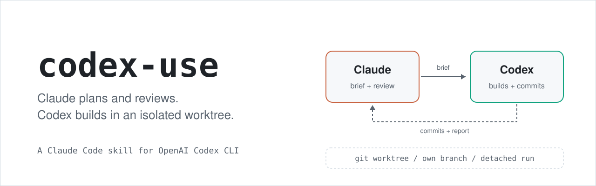
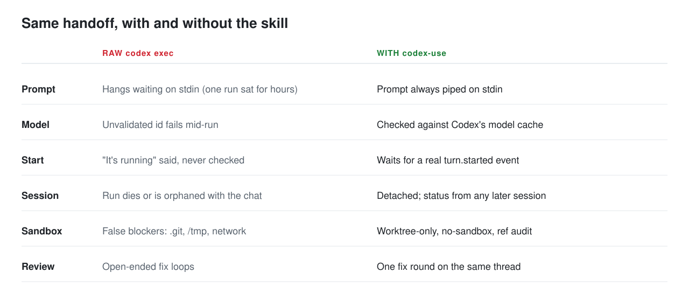
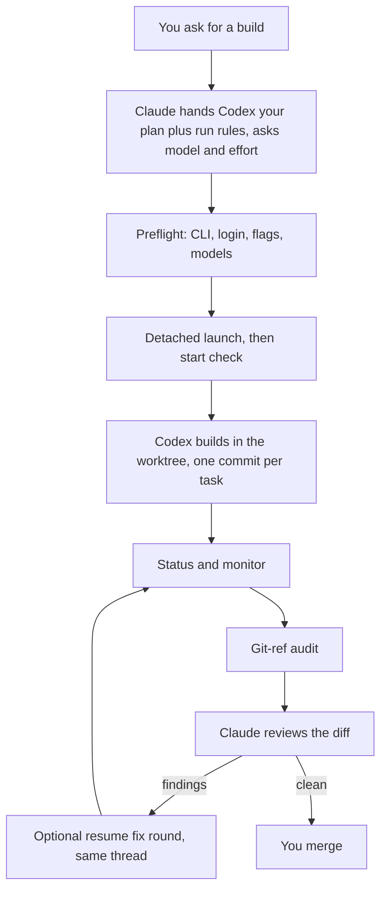

<p align="center">
  <picture>
    <source media="(prefers-color-scheme: dark)" srcset="assets/hero-dark.svg">
    
  </picture>
</p>

<p align="center">
  <a href="LICENSE"></a>
  
  
  
</p>

A Claude Code skill that hands a task to OpenAI's Codex CLI (`codex exec`), checks that it really started, waits without blocking, and brings back a verified result.

## Quick start

```
git clone https://github.com/guydotan55/codex-use ~/.claude/skills/codex-use
```

Then, in a Claude Code session inside a git worktree on a non-main branch:

```
/codex-use build the settings page from docs/spec.md
```

Claude asks which Codex model and effort to use, hands Codex your plan plus the rules for the run, launches it, confirms it started, and reports back when it is done. Requirements are [below](#requirements).

## Why use it

Two coding agents are better than one when each does what it is good at. The idea here is a split:

- **Claude plans and reviews.** It has your conversation and context.
- **Codex builds**, in an isolated git worktree on its own branch, committing as it goes.

The skill does not write your spec or plan; you and Claude do that first. What it adds is a short brief: it points Codex at your plan ("read these files, then do tasks 1-5") and sets the rules for the run: stay in the worktree, don't push, commit after each task, don't ask questions, report back in a fixed format. Codex cannot see your chat with Claude, so anything not in the brief does not exist for it. For a small job with no plan, the brief is the whole instruction.

The hard part is the handoff. Done by hand it is a pile of small ways to lose time, and this skill encodes the fixes so you do not re-derive them:

- **No babysitting.** The prompt is piped on stdin, so the run cannot hang on "Reading additional input from stdin". The model is checked against Codex's own model cache before launch, and the effort level is clamped to what that model supports.
- **No "is it running?"** The skill waits for a real `turn.started` event before saying Codex is running, and shows Codex's own record of the model, effort and sandbox it used.
- **Runs survive the session.** Codex is detached into its own process group. Close the chat, come back later, and `codex status` lists every run: running, finished, or died.
- **A bounded review loop.** After the build, Claude reviews the diff, and you can send one fix round to the same Codex thread, which still has the code in context. A second round is never automatic.
- **Guardrails by default.** Build mode refuses `main`, `master` and a detached HEAD, snapshots git refs before the run and audits them after, and asks Codex for one commit per task so progress is visible and recoverable. See [Safety](#safety) for what this does and does not protect.

<picture>
  <source media="(prefers-color-scheme: dark)" srcset="assets/before-after-dark.svg">
  
</picture>

Each row comes from a real failure; the stories are in [references/lessons.md](references/lessons.md).

## Workflow



## Requirements

- Claude Code
- Codex CLI, logged in (`codex login`). Tested on codex-cli 0.159.3; preflight reports flag drift on other versions.
- `jq`, `perl`, `git`, `bash` (3.2 compatible)
- macOS is tested. Linux is best-effort and not yet tested.

If you install somewhere other than `~/.claude/skills/codex-use`, adjust the `S=` path in `SKILL.md`.

## Usage

- `/codex-use` or "send this to codex": pick model and effort; Claude hands Codex your plan plus the run rules and launches.
- "codex status" or "is codex done?": lists runs, including ones from earlier sessions.
- After a review, "have codex fix these": resumes the same thread as `attempt-2`.
- "stop codex": stops the attempt cleanly.

The scripts also work standalone (all have `--help`): `codex-preflight.sh`, `codex-launch.sh`, `codex-status.sh`, `codex-stop.sh`.

## How it works

Preflight checks the CLI, login and flags and reads available models. The launcher refuses `main`, `master` and a detached HEAD in build mode, snapshots git refs, writes a registry entry, and starts Codex in its own session and process group. State lives in `~/.codex-use/` (`runs/<run>/attempt-N/`, `runs.log`, `active.json`, `last.json`). Status reads Codex's event stream, commits since start, and Codex's own session record. Commits are the progress signal you can trust, so briefs ask for one commit per task.

## Safety

Build mode runs Codex with `--dangerously-bypass-approvals-and-sandbox`. Codex can run any command as you, use the network, and write anywhere your user can.

Guardrails:

- Build mode only starts in a git worktree on a non-main branch.
- Git refs in the main repository are snapshotted and audited afterwards; changes beyond the run's own branch are flagged as a breach.
- The brief tells Codex not to push, switch branches, or write outside the worktree and `/tmp`; `GIT_TERMINAL_PROMPT=0` is set.
- Read-only mode (`-s read-only`) exists for repo review. It cannot be resumed and has no network.

Not guarantees:

- The brief rules are instructions, not enforcement. Nothing stops Codex writing outside the worktree, reading secrets in your home directory, or touching other repos.
- Only git refs are audited, not the filesystem.
- Do not point it at untrusted repos or briefs: instructions hidden in repo content can steer a run that has no sandbox.
- `~/.codex-use/` stores briefs, event streams and logs, which may contain sensitive content.
- The skill reads undocumented Codex internals (`models_cache.json`, session records) and may break when Codex changes.

Use a disposable worktree and review the diff before pushing. See also [SECURITY.md](SECURITY.md).

## FAQ

**Do I need an OpenAI login?** You need Codex CLI logged in (`codex login`); preflight asks the CLI itself. Which models you can use depends on your Codex account.

**Why no sandbox?** Codex's sandbox blocked the worktree's `.git`, `/tmp` and the network, and Codex then reported false blockers and stopped. The skill trades the sandbox for a worktree, a ref audit and commit-per-task. That is a real trade; read [Safety](#safety).

**Does it work on Linux?** It is written to, and the known macOS-only calls have fallbacks, but only macOS has been tested. Reports welcome.

**Can I use it without Claude Code?** Yes. The four scripts are plain bash and run standalone. You lose the dialog, the plan handoff and the review step.

**What does it cost?** The skill itself is free. Codex usage counts against your Codex plan; the status output shows token usage per run.

## Related

- [Codex CLI](https://github.com/openai/codex)
- [Claude Code skills](https://code.claude.com/docs/en/skills)

## License

[MIT](LICENSE)
